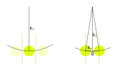
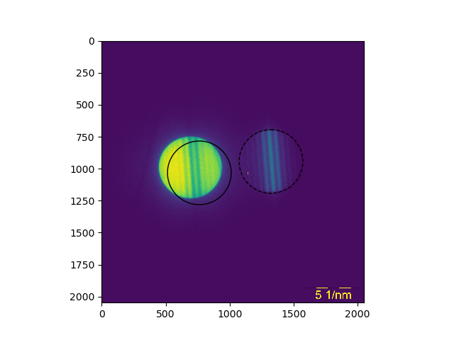
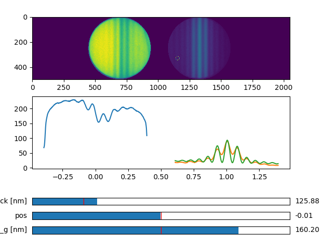

# CBED Thickness

$$ | \vec{k} + \vec{g} + \vec{s}_g | ^2 =  k^2 $$

$$ (k_x + g)^2 + (k_z + s_g)^2 =  k_x^2 + k_z^2 $$

$$ 2 k_x g + g^2 + 2 k_z s_g + s_g^2 = 0 $$

$$  s_g = \sqrt{ k_z^2 -(2k_x+g)g} - k_z $$

After linearisation:

$$ s_g \approx -\frac{(2k_x+g)g}{2k_z}$$

$$ s_{ef} =  \sqrt{s_g^2 + \frac{1}{\xi_g^2}}$$

$$I = \frac {\sin^2 ( \pi  t  s_{ef} ) } {\xi_g^2 s_{ef}^2 }  $$

# Example

Drag circles to select direct and diffracted CBED disk

Fit the pattern

